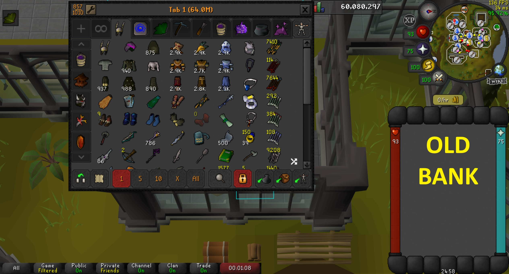
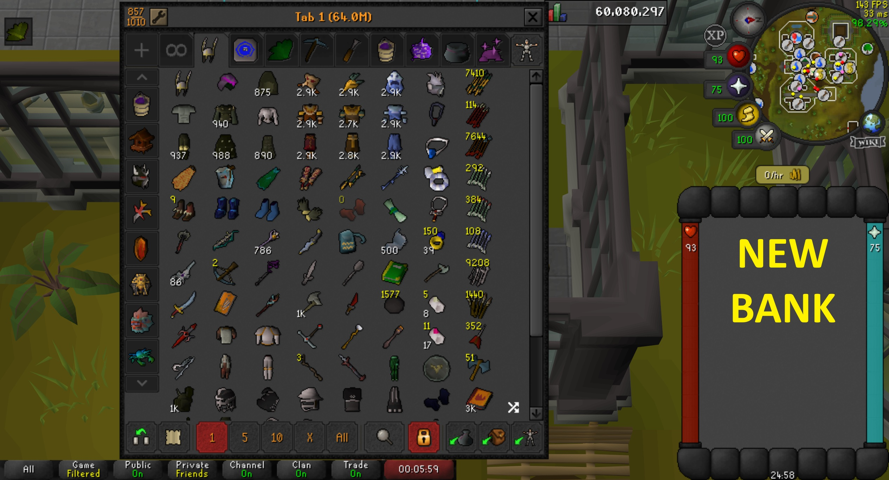
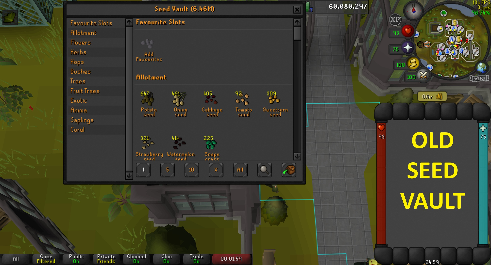
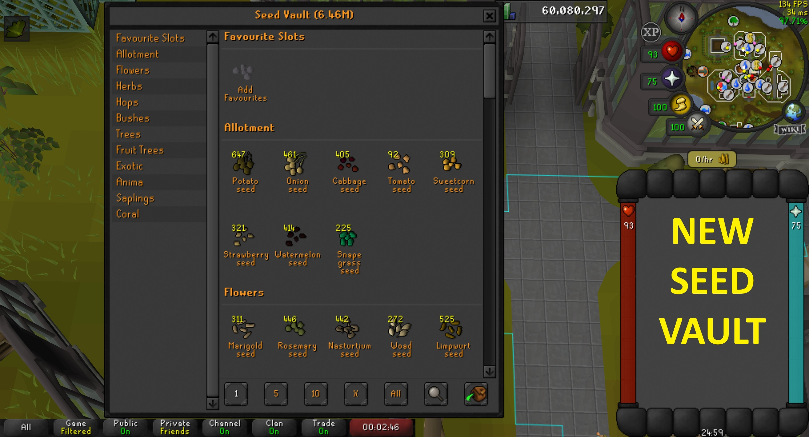
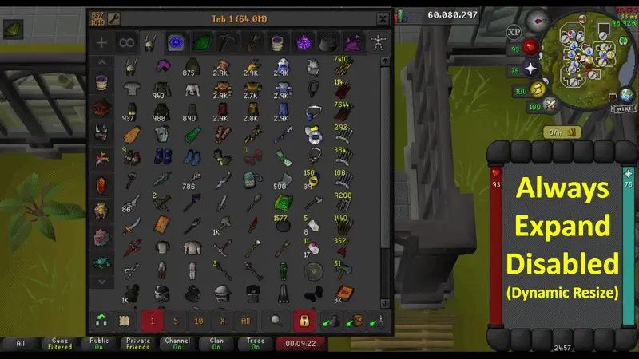
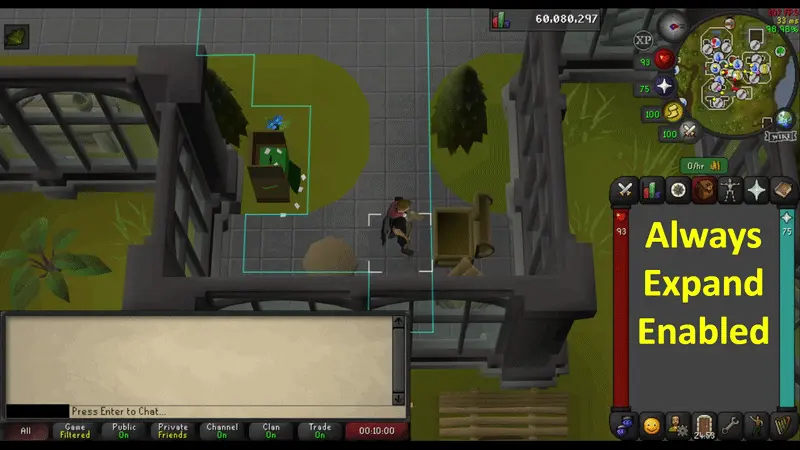

# Expanded Bank

A RuneLite plugin that dynamically expands the Bank and Seed Vault interfaces to utilize all available vertical space when the chatbox is minimized.

## Features

* **Bank Expansion:** Automatically stretches the Bank interface down to the chatbox buttons when the chatbox is minimized.
* **Seed Vault Expansion:** Provides the same vertical expansion for the Seed Vault in the Farming Guild.
* **Always Expand Toggle:** An optional setting to force the bank to expand and hide the chatbox upon opening, regardless of its previous state.

---

## Visual Comparisons

### Bank
| Default                         | Expanded                        |
|:--------------------------------|:--------------------------------|
|  |  |

### Seed Vault
| Default                                     | Expanded                                    |
|:--------------------------------------------|:--------------------------------------------|
|  |  |

---

## Configuration Options

### Always Expand
When enabled, this feature ensures the bank interface is always maximized by automatically hiding the chatbox visuals whenever the bank is opened and restoring them when the bank is closed.

| Always Expand: OFF                                           | Always Expand: ON                                          |
|:-------------------------------------------------------------|:-----------------------------------------------------------|
|  |  |

---

## Compatibility

This plugin is designed for **Resizable** layouts only. For Fixed layout users, similar functionality is provided by the 'Fixed Mode Hide Chat' plugin, which served as the inspiration for this project.

This plugin should be fully compatible with most bank plugins, most notably: Bank Tags and Bank Tag Layouts.

If you encounter any issues, please report them [here](https://github.com/VolkezXO/Expanded-bank/issues).

---

## License

This project is licensed under the BSD 2-Clause License - see the [LICENSE](LICENSE) file for details.